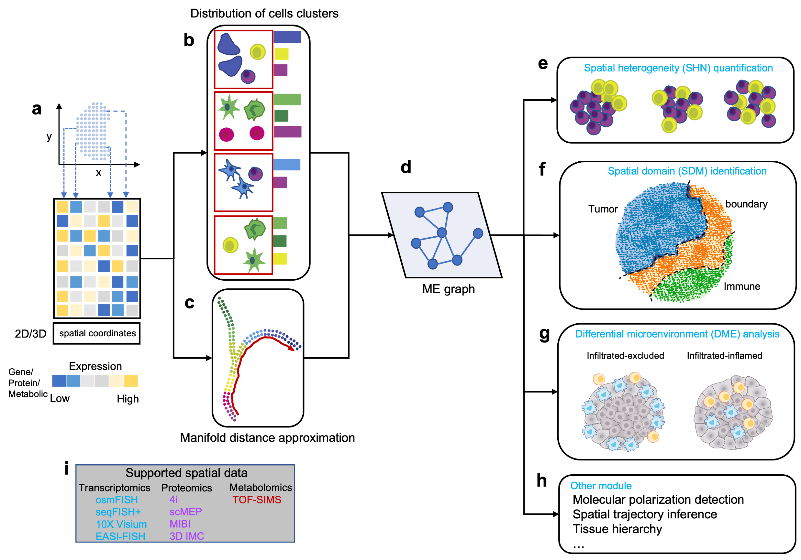

# SOTIP  v1.0

## SOTIP is a unified framework for spatial omics microenvironment analysis

### Developer: Zhiyuan Yuan (yuanzy16@mails.tsinghua.edu.cn)

The rapid development of spatial omics techniques generates datasets with diverse scales and modalities. However, most existing methods focus on modeling dynamics of single cells and ignore microenvironments (MEs) which bridge single cells to tissues. Here we present SOTIP, a scalable framework incorporating MEs and their relationships into a unified graph. Based on this graph, three tasks can be performed, namely, spatial heterogeneity (SHN) quantification, spatial domain (SDM) identification and differential microenvironment (DME) analysis. We validate SOTIP’s high performance of accuracy, robustness, interpretation, and scalability on various datasets by comparing with state-of-art methods. In mammalian cerebral cortex, we reveal a striking gradient SHN pattern with strong correlations with the cortical depth. In human triple-negative breast cancer (TNBC), we identify previously unreported molecular polarizations around SOTIP-detected tumor-immune boundaries. Most importantly, we discover MEs which specifically occur in different TNBC subtypes with certain compositional and spatial properties, could be powerful clinical indicators. Overall, by modeling biologically explainable microenvironments, SOTIP outperforms state-of-art methods and provides new perspectives for data interpretation, which facilitates further understanding of spatial information on a variety of biological issues.

## Usage

The [**SOTIP**](https://github.com/TencentAILabHealthcare/SOTIP) package is a graph based analytical framework for various spatial omics data. There are three modules for SOTIP:

- Spatial heterogeneity (SHN) quantification. [**4i**](https://github.com/TencentAILabHealthcare/SOTIP/tree/master/SOTIP_analysis/tutorial/4i_HeLa.ipynb),  [**Visium**](https://github.com/yuanzhiyuan/SOTIP/tree/master/SOTIP_analysis/tutorial/Visium_Zebrafish.ipynb)
- Spatial domain (SDM) identification. [**MIBI**](https://github.com/TencentAILabHealthcare/SOTIP/tree/master/SOTIP_analysis/tutorial/MIBI_TNBC.ipynb),  [**scMEP**](https://github.com/yuanzhiyuan/SOTIP/tree/master/SOTIP_analysis/tutorial/scMEP_CLCC.ipynb),  [**Visium**](https://github.com/yuanzhiyuan/SOTIP/tree/master/SOTIP_analysis/tutorial/Visium_Cortex.ipynb),  [**osmFISH**](https://github.com/yuanzhiyuan/SOTIP/tree/master/SOTIP_analysis/tutorial/osmFISH_cortex.ipynb)
- Differential microenvironment (DME) analysis. [**MIBI**](https://github.com/TencentAILabHealthcare/SOTIP/tree/master/SOTIP_analysis/MIBI_TNBC/DMA_TNBC.ipynb)
- SOTIP supports various spatial omics protocols ranging from spatial transcriptomics (10x Visium, osmFISH, seqFISH+), spatial proteomics (4i, MIBI-TOF, scMEP), and spatial metabolomics (TOF-SIMS).

#### Example of SDM identification on 10x Visium

 
Herarchical merging for 10x Visium data

#### Example of SDM identification on MIBI-TOF

 
Herarchical merging for MIBI-TOF data

## Tutorial
Please install Jupyter in order to open these notebooks.

For the step-by-step tutorial, please refer to: 
 
https://github.com/TencentAILabHealthcare/SOTIP/tree/master/SOTIP_analysis/tutorial/
 

For the reproduction of paper's results, please refer to:
 
https://github.com/TencentAILabHealthcare/SOTIP/tree/master/SOTIP_analysis/
 

Please download demo datasets from following doi: 
 
10.6084/m9.figshare.18516128.
 

## How to install?
- git clone this repository
- python setup.py install
- conda install pyemd

## SOTIP has been tested on

- System: CentOS
- Python: 3.8.0
- Python packages: numpy==1.21.2 pandas==1.3.4 scipy==1.7.1 matplotlib==3.4.3 seaborn==0.11.2 scanpy==1.8.2  squidpy==1.1.2 palettable==3.3.0 scikit-learn==1.0.1 networkx==2.6.3 shapely==1.8.0 pyemd==0.5.1

## Disclaimer

This tool is for research purpose and not approved for clinical use.

This is not an official Tencent product.

## Copyright

This tool is developed in Tencent AI Lab.

The copyright holder for this project is Tencent AI Lab.

All rights reserved.

## References

Please consider citing the following reference:

- Zhiyuan Yuan, Yisi Li, Minglei Shi, Fan Yang, Juntao Gao, Jianhua Yao, Michael Zhang. SOTIP: a Unified Framework for Microenvironment Modelling with Spatial Omics Data, 19 January 2022, PREPRINT (Version 1) available at Research Square [https://doi.org/10.21203/rs.3.rs-1263025/v1]

 

